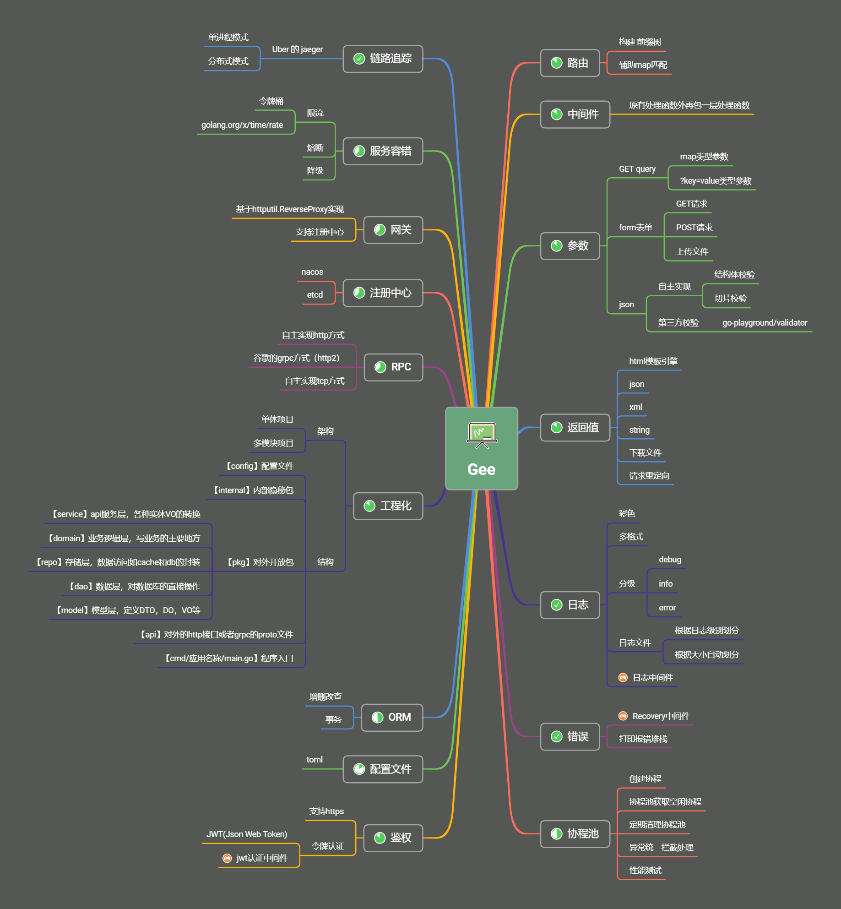

# gee

> 为什么要做web框架

- 开发如果使用原生go开发，很多基础工作都需要实现，为了简化开发，专心做业务开发，需要做一个web框架

> 框架的设计原则：
1. 高内聚，低耦合，便于维护和拓展
2. 封装底层实现，使用更为便捷
3. 封装重复性代码，减少代码编写量
4. 提供常用工具类

> 框架的主要功能：
1. 协调资源，比如数据库，文件，缓存等
2. 资源抽象，用于表示资源，程序通过一个抽象的概念与资源进行交互
3. 通信，资源之间需要进行沟通交流
4. 约定，大家遵照框架的约定，有助于简化框架的实现
5. 环境，框架需要支持不同的应用环境
6. 最主要的目的，让开发人员专注于编写业务逻辑，而不用关心别的事情

## 组成

### 1. 路由

当我们需要访问服务提供的资源时，我们需要使用类似这样的请求方式：

~~~
GET http://localhost:8080/api/getUser?id=1
POST http://localhost:8080/api/updateUser
~~~

观察上方的url，我们能得出一些结论：

1. http是固定的，依据协议支持，用户可以自行访问http或者https
2. localhost代表本机，实际上是ip地址127.0.0.1，需要注意域名实际上也是ip地址
3. 8080是端口，ip和端口才能定位一个服务，域名的端口默认是80，可以不写
4. `http://localhost:8080` 我们访问资源的时候，这部分是不变的，应用程序只需一次定义即可
5. `GET`和`POST`是http的请求方式，类似的还有`PUT`,`DELETE`等，这些我们的程序是需要支持的，同时这是需要开发人员自行定义的
6. `api/getUser`和`api/updateUser`是两个不同的资源路径，可以取得不同的结果，很明显这两个是需要开发人员自行定义的

> 我们的框架需要处理上方类似`api/updateUser`这样的路径请求，并根据请求方式将其转发到具体的业务逻辑执行代码，也就是说要在请求的URL和处理函数之间，搭建一个桥梁，将它们准确的关联起来，这就是`路由`。

#### 1.1 请求参数

在进行路由匹配的时候，往往我们需要将请求携带的参数进行对应的解析，以便后续的程序需要。

比如类似这样?id=1，代表get传参，/getUser/:id 代表路径传参，post传参中的json传参，文件传输等等

正常框架还应该支持`参数校验`等功能

#### 1.2 表单

请求参数的提交表单方式应用广泛，所以需要支持表单，同样需要支持表单参数校验

### 2. 处理器

路由的功能就是将请求路由到具体的Handler处理器中，在处理器中，我们需要处理请求（request），并且处理响应（response）

应该提供完善的请求处理方式和响应方式。

比如响应需要支持页面渲染，需要支持json，xml，html等方式

### 3. 中间件

当执行具体的处理器业务的时候，往往需要在其前后进行一些新增的功能，或者增强的功能，或者复用的代码，但是并不希望入侵代码，这就是中间件的作用

1. 日志
2. 错误处理
3. 认证权限
4. session
5. 解析请求体等

### 4. orm支持

应支持流行的orm，比如gorm，xorm或者自己实现的orm

### 5. 工具

比如常用的工具类，或者命令行工具，可以便捷生成代码

### 6. 配置项

将用到的一些第三方工具或者框架，做成可配置的，便于使用者进行替换
将一些配置，做成可配置的，便于开发者根据需要自行配置

### 7. 插件

提供丰富的插件，可以便捷集成服务，比如sentinel go集成

### 8. http协议支持

支持http https http2等

### 9. 内置模板

使用内置模板引擎提供模板渲染机制

